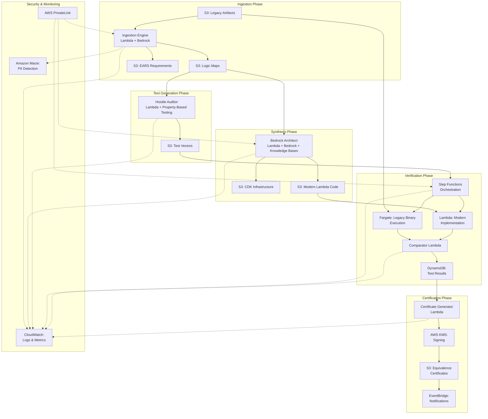

# Rosetta Zero - Technical Design Document

## Overview

Rosetta Zero is an autonomous system for modernizing legacy critical infrastructure code (COBOL, FORTRAN, mainframe binaries) while providing cryptographic proof of behavioral equivalence. The system addresses the critical challenge where aviation and banking infrastructure remains trapped on legacy systems because modernization risks invalidating safety certifications.

### Core Value Proposition

Traditional code modernization approaches fail for regulated industries because they cannot provide mathematical proof that the new system behaves identically to the legacy system. Rosetta Zero solves this by:

1. **Extracting behavioral logic** from legacy systems into an implementation-agnostic Logic Map
2. **Synthesizing modern implementations** that preserve exact behavioral semantics
3. **Generating adversarial test vectors** (1M+) using property-based testing techniques
4. **Executing parallel verification** comparing legacy and modern systems byte-by-byte
5. **Producing cryptographic certificates** proving behavioral equivalence for regulatory compliance

### Design Principles

1. **Zero Human Intervention**: Fully autonomous operation except for AWS 500-level errors
2. **Loop-Free Architecture**: No iterative refinement loops; discrepancies halt the pipeline
3. **Cryptographic Proof**: All verification results are cryptographically signed and immutable
4. **Adversarial Testing**: Property-based test generation targets edge cases and boundary conditions
5. **Regulatory Compliance**: Complete audit trails with 7-year retention for regulatory review

### System Boundaries

**In Scope:**
- Legacy code ingestion (COBOL, FORTRAN, mainframe binaries)
- Structural analysis and Logic Map extraction
- Modern AWS Lambda synthesis in Python 3.12
- Adversarial test vector generation (1M+ vectors)
- Parallel execution and byte-by-byte comparison
- Cryptographic certificate generation
- Immutable audit logging

**Out of Scope:**
- Interactive debugging or manual code review
- Performance optimization beyond behavioral preservation
- UI/UX for human operators (system is autonomous)
- Support for languages beyond COBOL, FORTRAN, mainframe binaries
- Real-time streaming workloads

## Architecture

### High-Level System Architecture



### Workflow Phases

The system operates through five sequential phases:

1. **Discovery Phase** (Ingestion Engine)
   - Ingest legacy binaries and source code
   - Extract structural logic into Logic Maps
   - Generate EARS requirements documents
   - Detect and document side effects

2. **Synthesis Phase** (Bedrock Architect)
   - Generate modern AWS Lambda functions from Logic Maps
   - Preserve behavioral semantics and side effects
   - Generate CDK infrastructure code
   - Access legacy language documentation via Knowledge Bases

3. **Aggression Phase** (Hostile Auditor)
   - Generate 1M+ adversarial test vectors
   - Target boundary conditions and edge cases
   - Ensure 95%+ branch coverage
   - Use property-based testing techniques

4. **Validation Phase** (Verification Environment)
   - Execute legacy and modern implementations in parallel
   - Compare outputs byte-by-byte
   - Capture and compare side effects
   - Generate discrepancy reports on failure

5. **Trust Phase** (Certificate Generation)
   - Generate cryptographic equivalence certificates
   - Sign certificates with AWS KMS
   - Publish completion events
   - Store immutable audit trails

### AWS Service Integration

| AWS Service | Purpose | Configuration |
|-------------|---------|---------------|
| **S3** | Artifact storage | Versioning enabled, KMS encryption, lifecycle policies |
| **Lambda** | Compute for all components | Python 3.12, PowerTools logging, VPC endpoints |
| **Bedrock** | LLM for analysis and synthesis | Claude 3.5 Sonnet, Knowledge Bases for docs |
| **Step Functions** | Orchestration | Express workflows for parallel execution |
| **Fargate** | Legacy binary execution | Docker containers, isolated networking |
| **DynamoDB** | Test result storage | Point-in-time recovery, KMS encryption |
| **KMS** | Cryptographic operations | Certificate signing, data encryption |
| **CloudWatch** | Logging and metrics | 7-year retention, encryption enabled |
| **EventBridge** | Event notifications | Phase completion, failure alerts |
| **Macie** | PII detection | Automated scanning of legacy code |
| **SNS** | Operator notifications | AWS 500-level error alerts |
| **PrivateLink** | Secure networking | Service-to-service communication |
| **VPC** | Network isolation | Private subnets, no internet gateway |


## Components and Interfaces

### 1. Ingestion Engine

**Responsibility**: Analyze legacy artifacts and extract behavioral logic into implementation-agnostic Logic Maps.

**Implementation**: AWS Lambda function (Python 3.12) with Amazon Bedrock integration.

**Key Operations**:
- `ingest_artifact(artifact_path: str, artifact_type: ArtifactType) -> IngestionResult`
- `extract_logic_map(artifact: LegacyArtifact) -> LogicMap`
- `generate_ears_requirements(logic_map: LogicMap) -> EARSDocument`
- `detect_side_effects(artifact: LegacyArtifact) -> List[SideEffect]`

**Interfaces**:

```python
class IngestionEngine:
    """Analyzes legacy code and extracts behavioral logic."""
    
    def ingest_artifact(
        self,
        s3_bucket: str,
        s3_key: str,
        artifact_type: ArtifactType
    ) -> IngestionResult:
        """
        Ingest a legacy artifact from S3.
        
        Returns:
            IngestionResult containing artifact hash, storage location,
            and ingestion timestamp.
        """
        pass
    
    def extract_logic_map(
        self,
        artifact: LegacyArtifact,
        bedrock_client: BedrockClient
    ) -> LogicMap:
        """
        Extract behavioral logic using Amazon Bedrock.
        
        Invokes Claude 3.5 Sonnet to analyze code structure and
        generate implementation-agnostic Logic Map.
        
        Returns:
            LogicMap containing entry points, data structures,
            control flow, and dependencies.
        """
        pass
    
    def generate_ears_requirements(
        self,
        logic_map: LogicMap
    ) -> EARSDocument:
        """
        Generate EARS-compliant requirements from Logic Map.
        
        Returns:
            EARSDocument with formal behavioral specifications.
        """
        pass
    
    def detect_side_effects(
        self,
        artifact: LegacyArtifact,
        logic_map: LogicMap
    ) -> List[SideEffect]:
        """
        Identify all observable side effects in legacy code.
        
        Detects: global variables, file I/O, database operations,
        hardware interactions, network operations.
        
        Returns:
            List of SideEffect objects with operation type and scope.
        """
        pass
```

**AWS Integration**:
- **Input**: S3 bucket with legacy artifacts
- **Output**: S3 buckets for Logic Maps and EARS documents
- **LLM**: Amazon Bedrock (Claude 3.5 Sonnet)
- **PII Scanning**: Amazon Macie integration
- **Logging**: CloudWatch Logs with structured JSON

**Error Handling**:
- Transient Bedrock API errors: Retry with exponential backoff (3 attempts)
- PII detection: Redact before analysis, log detection event
- Invalid artifact format: Log error, publish failure event, halt pipeline

### 2. Bedrock Architect

**Responsibility**: Synthesize modern AWS Lambda functions that preserve exact behavioral semantics from Logic Maps.

**Implementation**: AWS Lambda function (Python 3.12) with Amazon Bedrock and Knowledge Bases integration.

**Key Operations**:
- `synthesize_lambda(logic_map: LogicMap) -> ModernImplementation`
- `generate_cdk_infrastructure(logic_map: LogicMap) -> CDKCode`
- `preserve_arithmetic_precision(logic_map: LogicMap) -> PrecisionConfig`
- `query_language_docs(language: str, semantic_question: str) -> str`

**Interfaces**:

```python
class BedrockArchitect:
    """Synthesizes modern AWS Lambda functions from Logic Maps."""
    
    def synthesize_lambda(
        self,
        logic_map: LogicMap,
        bedrock_client: BedrockClient,
        knowledge_base_id: str
    ) -> ModernImplementation:
        """
        Generate AWS Lambda function preserving behavioral semantics.
        
        Uses Amazon Bedrock with Knowledge Bases to query legacy
        language documentation for accurate semantic translation.
        
        Returns:
            ModernImplementation containing Python 3.12 Lambda code,
            error handling, logging, and side effect preservation.
        """
        pass
    
    def generate_cdk_infrastructure(
        self,
        logic_map: LogicMap,
        modern_impl: ModernImplementation
    ) -> CDKCode:
        """
        Generate AWS CDK infrastructure code for deployment.
        
        Returns:
            CDKCode defining Lambda functions, IAM roles, VPC config,
            and required AWS resources.
        """
        pass
    
    def preserve_arithmetic_precision(
        self,
        logic_map: LogicMap
    ) -> PrecisionConfig:
        """
        Extract arithmetic precision requirements from legacy code.
        
        Identifies fixed-point arithmetic, floating-point precision,
        and rounding modes that must be preserved.
        
        Returns:
            PrecisionConfig documenting all arithmetic decisions.
        """
        pass
    
    def query_language_docs(
        self,
        language: str,
        semantic_question: str,
        knowledge_base_id: str
    ) -> str:
        """
        Query legacy language documentation via Bedrock Knowledge Bases.
        
        Args:
            language: COBOL, FORTRAN, or mainframe system
            semantic_question: Specific language semantic query
            
        Returns:
            Documentation excerpt relevant to the query.
        """
        pass
```

**AWS Integration**:
- **Input**: S3 bucket with Logic Maps
- **Output**: S3 buckets for modern Lambda code and CDK infrastructure
- **LLM**: Amazon Bedrock (Claude 3.5 Sonnet)
- **Documentation**: Bedrock Knowledge Bases (COBOL, FORTRAN, mainframe docs)
- **Logging**: CloudWatch Logs with synthesis decision tracking

**Constraints**:
- **Faithful Transpilation**: Implement ONLY behaviors in Logic Map
- **No Feature Addition**: Do not add features absent from legacy system
- **Precision Preservation**: Match legacy arithmetic exactly
- **Side Effect Preservation**: Replicate all observable side effects

### 3. Hostile Auditor

**Responsibility**: Generate adversarial test vectors using property-based testing techniques to maximize edge case coverage.

**Implementation**: AWS Lambda function (Python 3.12) with Hypothesis library for property-based test generation.

**Key Operations**:
- `generate_test_vectors(logic_map: LogicMap, count: int) -> List[TestVector]`
- `generate_boundary_tests(data_types: List[DataType]) -> List[TestVector]`
- `ensure_branch_coverage(logic_map: LogicMap, vectors: List[TestVector]) -> CoverageReport`

**Interfaces**:

```python
class HostileAuditor:
    """Generates adversarial test vectors for behavioral verification."""
    
    def generate_test_vectors(
        self,
        logic_map: LogicMap,
        target_count: int = 1_000_000,
        random_seed: Optional[int] = None
    ) -> List[TestVector]:
        """
        Generate adversarial test vectors using property-based testing.
        
        Uses Hypothesis library to generate diverse inputs targeting:
        - Boundary values (MAX_INT, MIN_INT)
        - Date edge cases (leap years, century boundaries)
        - Currency overflow scenarios
        - Character encoding edge cases (EBCDIC mappings)
        - Null and empty inputs
        - Maximum length strings
        
        Args:
            logic_map: Logic Map defining system behavior
            target_count: Number of test vectors to generate (default 1M)
            random_seed: Seed for reproducibility (stored with results)
            
        Returns:
            List of TestVector objects covering all entry points and
            control flow branches.
        """
        pass
    
    def generate_boundary_tests(
        self,
        data_types: List[DataType]
    ) -> List[TestVector]:
        """
        Generate test vectors for boundary conditions.
        
        Returns:
            Test vectors targeting min/max values, overflow conditions,
            and precision boundaries.
        """
        pass
    
    def ensure_branch_coverage(
        self,
        logic_map: LogicMap,
        vectors: List[TestVector]
    ) -> CoverageReport:
        """
        Verify test vectors achieve 95%+ branch coverage.
        
        Returns:
            CoverageReport documenting coverage percentage and
            uncovered branches.
        """
        pass
```

**AWS Integration**:
- **Input**: S3 bucket with Logic Maps
- **Output**: S3 bucket with test vectors (batched for parallel processing)
- **Storage**: DynamoDB for random seed tracking
- **Logging**: CloudWatch Logs with generation metrics

**Test Vector Categories**:
1. **Boundary Values**: MAX_INT, MIN_INT, zero, negative zero
2. **Date Edge Cases**: Leap years, century boundaries, Y2K scenarios
3. **Currency Overflow**: Maximum precision, rounding boundaries
4. **Character Encoding**: EBCDIC to ASCII mappings, special characters
5. **Null/Empty**: Null pointers, empty strings, zero-length arrays
6. **Maximum Length**: Buffer boundaries, string length limits

### 4. Verification Environment

**Responsibility**: Execute legacy and modern implementations in parallel, compare outputs byte-by-byte, and generate discrepancy reports.

**Implementation**: AWS Step Functions orchestrating Fargate containers (legacy) and Lambda functions (modern).

**Key Operations**:
- `execute_parallel_tests(test_vectors: List[TestVector]) -> List[TestResult]`
- `execute_legacy_binary(test_vector: TestVector) -> ExecutionResult`
- `execute_modern_lambda(test_vector: TestVector) -> ExecutionResult`
- `compare_outputs(legacy_result: ExecutionResult, modern_result: ExecutionResult) -> ComparisonResult`
- `generate_discrepancy_report(comparison: ComparisonResult) -> DiscrepancyReport`

**Interfaces**:

```python
class VerificationEnvironment:
    """Orchestrates parallel testing and output comparison."""
    
    def execute_parallel_tests(
        self,
        test_vectors: List[TestVector],
        legacy_container_uri: str,
        modern_lambda_arn: str
    ) -> List[TestResult]:
        """
        Execute test vectors in parallel using Step Functions.
        
        Orchestrates:
        1. Fargate task for legacy binary execution
        2. Lambda invocation for modern implementation
        3. Output comparison
        4. Result storage in DynamoDB
        
        Returns:
            List of TestResult objects with pass/fail status.
        """
        pass
    
    def execute_legacy_binary(
        self,
        test_vector: TestVector,
        container_uri: str
    ) -> ExecutionResult:
        """
        Execute legacy binary in Fargate container.
        
        Captures:
        - Return value
        - stdout/stderr
        - File system writes
        - Network operations
        - Execution duration
        
        Returns:
            ExecutionResult with all captured outputs and side effects.
        """
        pass
    
    def execute_modern_lambda(
        self,
        test_vector: TestVector,
        lambda_arn: str
    ) -> ExecutionResult:
        """
        Execute modern Lambda implementation.
        
        Captures:
        - Return value
        - stdout/stderr (CloudWatch Logs)
        - Side effects (S3 writes, DynamoDB operations)
        - Execution duration
        
        Returns:
            ExecutionResult with all captured outputs and side effects.
        """
        pass
    
    def compare_outputs(
        self,
        legacy_result: ExecutionResult,
        modern_result: ExecutionResult
    ) -> ComparisonResult:
        """
        Compare outputs byte-by-byte.
        
        Compares:
        - Return values (byte-by-byte)
        - stdout content (byte-by-byte)
        - stderr content (byte-by-byte)
        - Side effects (file writes, database operations)
        
        Returns:
            ComparisonResult with match status and difference details.
        """
        pass
    
    def generate_discrepancy_report(
        self,
        test_vector: TestVector,
        comparison: ComparisonResult
    ) -> DiscrepancyReport:
        """
        Generate detailed discrepancy report on test failure.
        
        Includes:
        - Test vector input values
        - Legacy output values
        - Modern output values
        - Byte-level diff
        - Execution timestamps
        - All side effects
        
        Returns:
            DiscrepancyReport stored in S3 for analysis.
        """
        pass
```

**AWS Integration**:
- **Orchestration**: Step Functions Express Workflows
- **Legacy Execution**: Fargate tasks with Docker containers
- **Modern Execution**: Lambda function invocations
- **Result Storage**: DynamoDB with point-in-time recovery
- **Discrepancy Storage**: S3 with versioning
- **Logging**: CloudWatch Logs for all executions

**Step Functions Workflow**:

```json
{
  "Comment": "Parallel test execution workflow",
  "StartAt": "ParallelExecution",
  "States": {
    "ParallelExecution": {
      "Type": "Parallel",
      "Branches": [
        {
          "StartAt": "ExecuteLegacy",
          "States": {
            "ExecuteLegacy": {
              "Type": "Task",
              "Resource": "arn:aws:states:::ecs:runTask.sync",
              "Parameters": {
                "LaunchType": "FARGATE",
                "Cluster": "rosetta-zero-cluster",
                "TaskDefinition": "legacy-executor",
                "NetworkConfiguration": {
                  "AwsvpcConfiguration": {
                    "Subnets": ["${PrivateSubnet}"],
                    "SecurityGroups": ["${SecurityGroup}"]
                  }
                }
              },
              "End": true
            }
          }
        },
        {
          "StartAt": "ExecuteModern",
          "States": {
            "ExecuteModern": {
              "Type": "Task",
              "Resource": "arn:aws:states:::lambda:invoke",
              "Parameters": {
                "FunctionName": "modern-implementation",
                "Payload": {
                  "testVector.$": "$.testVector"
                }
              },
              "End": true
            }
          }
        }
      ],
      "Next": "CompareOutputs"
    },
    "CompareOutputs": {
      "Type": "Task",
      "Resource": "arn:aws:states:::lambda:invoke",
      "Parameters": {
        "FunctionName": "output-comparator",
        "Payload": {
          "legacyResult.$": "$[0]",
          "modernResult.$": "$[1]"
        }
      },
      "Next": "CheckMatch"
    },
    "CheckMatch": {
      "Type": "Choice",
      "Choices": [
        {
          "Variable": "$.match",
          "BooleanEquals": true,
          "Next": "StorePassResult"
        },
        {
          "Variable": "$.match",
          "BooleanEquals": false,
          "Next": "GenerateDiscrepancyReport"
        }
      ]
    },
    "StorePassResult": {
      "Type": "Task",
      "Resource": "arn:aws:states:::dynamodb:putItem",
      "Parameters": {
        "TableName": "test-results",
        "Item": {
          "testId": {"S.$": "$.testId"},
          "status": {"S": "PASS"},
          "timestamp": {"S.$": "$$.State.EnteredTime"}
        }
      },
      "End": true
    },
    "GenerateDiscrepancyReport": {
      "Type": "Task",
      "Resource": "arn:aws:states:::lambda:invoke",
      "Parameters": {
        "FunctionName": "discrepancy-reporter",
        "Payload.$": "$"
      },
      "Next": "HaltPipeline"
    },
    "HaltPipeline": {
      "Type": "Fail",
      "Error": "BehavioralDiscrepancy",
      "Cause": "Legacy and modern implementations produced different outputs"
    }
  }
}
```

### 5. Certificate Generator

**Responsibility**: Generate cryptographically signed equivalence certificates when all tests pass.

**Implementation**: AWS Lambda function (Python 3.12) with AWS KMS integration.

**Key Operations**:
- `generate_certificate(test_results: List[TestResult]) -> EquivalenceCertificate`
- `sign_certificate(certificate: EquivalenceCertificate) -> SignedCertificate`
- `publish_completion_event(certificate: SignedCertificate) -> None`

**Interfaces**:

```python
class CertificateGenerator:
    """Generates cryptographically signed equivalence certificates."""
    
    def generate_certificate(
        self,
        test_results: List[TestResult],
        legacy_artifact: ArtifactMetadata,
        modern_implementation: ArtifactMetadata
    ) -> EquivalenceCertificate:
        """
        Generate equivalence certificate from test results.
        
        Includes:
        - Total test vector count
        - SHA-256 hash of all test results
        - Legacy binary identifier and version
        - Modern implementation identifier and version
        - Test execution date range
        - All test result hashes
        
        Returns:
            EquivalenceCertificate ready for cryptographic signing.
        """
        pass
    
    def sign_certificate(
        self,
        certificate: EquivalenceCertificate,
        kms_key_id: str
    ) -> SignedCertificate:
        """
        Sign certificate using AWS KMS.
        
        Uses asymmetric signing key for regulatory compliance.
        
        Returns:
            SignedCertificate with cryptographic signature.
        """
        pass
    
    def publish_completion_event(
        self,
        certificate: SignedCertificate,
        eventbridge_bus: str
    ) -> None:
        """
        Publish certificate generation event to EventBridge.
        
        Triggers downstream workflows and operator notifications.
        """
        pass
```

**AWS Integration**:
- **Input**: DynamoDB table with test results
- **Output**: S3 bucket with signed certificates
- **Signing**: AWS KMS asymmetric signing key
- **Events**: EventBridge for completion notifications
- **Logging**: CloudWatch Logs with certificate metadata


## Data Models

### LogicMap

Intermediate representation of legacy system behavior without implementation details.

```python
@dataclass
class LogicMap:
    """Implementation-agnostic representation of legacy system behavior."""
    
    artifact_id: str
    artifact_version: str
    extraction_timestamp: datetime
    
    entry_points: List[EntryPoint]
    data_structures: List[DataStructure]
    control_flow: ControlFlowGraph
    dependencies: List[Dependency]
    side_effects: List[SideEffect]
    arithmetic_precision: PrecisionConfig
    
    def to_json(self) -> str:
        """Serialize Logic Map to JSON for storage."""
        pass
    
    @classmethod
    def from_json(cls, json_str: str) -> 'LogicMap':
        """Deserialize Logic Map from JSON."""
        pass

@dataclass
class EntryPoint:
    """Entry point in legacy system."""
    name: str
    parameters: List[Parameter]
    return_type: DataType
    description: str

@dataclass
class DataStructure:
    """Data structure in legacy system."""
    name: str
    fields: List[Field]
    size_bytes: int
    alignment: int

@dataclass
class ControlFlowGraph:
    """Control flow representation."""
    nodes: List[ControlFlowNode]
    edges: List[ControlFlowEdge]
    
    def calculate_branch_coverage(self, executed_paths: List[Path]) -> float:
        """Calculate branch coverage percentage."""
        pass

@dataclass
class SideEffect:
    """Observable side effect in legacy system."""
    operation_type: SideEffectType  # FILE_IO, DATABASE, NETWORK, GLOBAL_VAR, HARDWARE
    scope: str
    description: str
    timing_requirements: Optional[TimingRequirement]

@dataclass
class PrecisionConfig:
    """Arithmetic precision requirements."""
    fixed_point_operations: List[FixedPointOp]
    floating_point_precision: Dict[str, int]  # operation -> precision bits
    rounding_modes: Dict[str, RoundingMode]
```

### TestVector

Input data for behavioral verification testing.

```python
@dataclass
class TestVector:
    """Test input for behavioral verification."""
    
    vector_id: str
    generation_timestamp: datetime
    random_seed: int
    
    entry_point: str
    input_parameters: Dict[str, Any]
    expected_coverage: Set[str]  # Branch IDs expected to be covered
    
    category: TestVectorCategory  # BOUNDARY, DATE_EDGE, CURRENCY, ENCODING, NULL_EMPTY, MAX_LENGTH
    
    def to_json(self) -> str:
        """Serialize test vector to JSON."""
        pass
    
    @classmethod
    def from_json(cls, json_str: str) -> 'TestVector':
        """Deserialize test vector from JSON."""
        pass

@dataclass
class TestVectorBatch:
    """Batch of test vectors for parallel processing."""
    batch_id: str
    vectors: List[TestVector]
    total_count: int
    batch_index: int
```

### ExecutionResult

Output from executing a test vector against an implementation.

```python
@dataclass
class ExecutionResult:
    """Result from executing a test vector."""
    
    test_vector_id: str
    implementation_type: ImplementationType  # LEGACY or MODERN
    execution_timestamp: datetime
    
    return_value: bytes
    stdout: bytes
    stderr: bytes
    
    side_effects: List[ObservedSideEffect]
    execution_duration_ms: int
    
    error: Optional[ExecutionError]
    
    def compute_hash(self) -> str:
        """Compute SHA-256 hash of execution result."""
        return hashlib.sha256(
            self.return_value + self.stdout + self.stderr
        ).hexdigest()

@dataclass
class ObservedSideEffect:
    """Side effect observed during execution."""
    effect_type: SideEffectType
    operation: str
    data: bytes
    timestamp: datetime
```

### ComparisonResult

Result of comparing legacy and modern execution outputs.

```python
@dataclass
class ComparisonResult:
    """Result of byte-by-byte output comparison."""
    
    test_vector_id: str
    comparison_timestamp: datetime
    
    match: bool
    
    return_value_match: bool
    stdout_match: bool
    stderr_match: bool
    side_effects_match: bool
    
    differences: Optional[DifferenceDetails]
    
    result_hash: str  # SHA-256 of comparison result

@dataclass
class DifferenceDetails:
    """Detailed information about output differences."""
    
    return_value_diff: Optional[ByteDiff]
    stdout_diff: Optional[ByteDiff]
    stderr_diff: Optional[ByteDiff]
    side_effect_diffs: List[SideEffectDiff]

@dataclass
class ByteDiff:
    """Byte-level difference between outputs."""
    offset: int
    legacy_bytes: bytes
    modern_bytes: bytes
    context_before: bytes
    context_after: bytes
```

### DiscrepancyReport

Detailed report generated when behavioral differences are detected.

```python
@dataclass
class DiscrepancyReport:
    """Report generated when outputs differ."""
    
    report_id: str
    generation_timestamp: datetime
    
    test_vector: TestVector
    legacy_result: ExecutionResult
    modern_result: ExecutionResult
    comparison: ComparisonResult
    
    root_cause_analysis: Optional[str]  # Generated by Bedrock if requested
    
    def to_json(self) -> str:
        """Serialize discrepancy report to JSON."""
        pass
    
    def generate_html_report(self) -> str:
        """Generate human-readable HTML report."""
        pass

# DynamoDB Schema for Discrepancy Reports
DISCREPANCY_REPORT_SCHEMA = {
    "TableName": "rosetta-zero-discrepancy-reports",
    "KeySchema": [
        {"AttributeName": "report_id", "KeyType": "HASH"}
    ],
    "AttributeDefinitions": [
        {"AttributeName": "report_id", "AttributeType": "S"},
        {"AttributeName": "generation_timestamp", "AttributeType": "S"}
    ],
    "GlobalSecondaryIndexes": [
        {
            "IndexName": "timestamp-index",
            "KeySchema": [
                {"AttributeName": "generation_timestamp", "KeyType": "HASH"}
            ],
            "Projection": {"ProjectionType": "ALL"}
        }
    ]
}
```

### EquivalenceCertificate

Cryptographically signed certificate proving behavioral equivalence.

```python
@dataclass
class EquivalenceCertificate:
    """Certificate proving behavioral equivalence."""
    
    certificate_id: str
    generation_timestamp: datetime
    
    legacy_artifact: ArtifactMetadata
    modern_implementation: ArtifactMetadata
    
    total_test_vectors: int
    test_execution_start: datetime
    test_execution_end: datetime
    
    test_results_hash: str  # SHA-256 of all test results
    individual_test_hashes: List[str]  # SHA-256 of each test result
    
    random_seed: int  # For test vector reproducibility
    
    coverage_report: CoverageReport
    
    def to_json(self) -> str:
        """Serialize certificate to JSON."""
        pass

@dataclass
class SignedCertificate:
    """Cryptographically signed equivalence certificate."""
    
    certificate: EquivalenceCertificate
    signature: bytes  # KMS signature
    signing_key_id: str  # KMS key ARN
    signature_algorithm: str  # e.g., "RSASSA_PSS_SHA_256"
    signing_timestamp: datetime
    
    def verify_signature(self, kms_client) -> bool:
        """Verify certificate signature using KMS."""
        pass
    
    def to_pem(self) -> str:
        """Export certificate in PEM format for regulatory submission."""
        pass

@dataclass
class ArtifactMetadata:
    """Metadata for legacy or modern artifact."""
    identifier: str
    version: str
    sha256_hash: str
    s3_location: str
    creation_timestamp: datetime

@dataclass
class CoverageReport:
    """Test coverage metrics."""
    branch_coverage_percent: float
    entry_points_covered: int
    total_entry_points: int
    uncovered_branches: List[str]
```

### TestResult

Individual test result stored in DynamoDB.

```python
@dataclass
class TestResult:
    """Individual test result for DynamoDB storage."""
    
    test_id: str  # Partition key
    execution_timestamp: str  # Sort key (ISO 8601)
    
    test_vector_id: str
    status: TestStatus  # PASS or FAIL
    
    legacy_result_hash: str
    modern_result_hash: str
    comparison_result_hash: str
    
    execution_duration_ms: int
    
    discrepancy_report_id: Optional[str]  # If status == FAIL

# DynamoDB Schema for Test Results
TEST_RESULT_SCHEMA = {
    "TableName": "rosetta-zero-test-results",
    "KeySchema": [
        {"AttributeName": "test_id", "KeyType": "HASH"},
        {"AttributeName": "execution_timestamp", "KeyType": "RANGE"}
    ],
    "AttributeDefinitions": [
        {"AttributeName": "test_id", "AttributeType": "S"},
        {"AttributeName": "execution_timestamp", "AttributeType": "S"},
        {"AttributeName": "status", "AttributeType": "S"}
    ],
    "GlobalSecondaryIndexes": [
        {
            "IndexName": "status-index",
            "KeySchema": [
                {"AttributeName": "status", "KeyType": "HASH"},
                {"AttributeName": "execution_timestamp", "KeyType": "RANGE"}
            ],
            "Projection": {"ProjectionType": "ALL"}
        }
    ],
    "PointInTimeRecoverySpecification": {
        "PointInTimeRecoveryEnabled": True
    },
    "SSESpecification": {
        "Enabled": True,
        "SSEType": "KMS",
        "KMSMasterKeyId": "alias/rosetta-zero-dynamodb"
    }
}
```

### Configuration

System configuration for customizing Rosetta Zero behavior.

```python
@dataclass
class RosettaZeroConfig:
    """System configuration."""
    
    # AWS Configuration
    aws_region: str
    s3_bucket_prefix: str
    kms_key_id: str
    vpc_id: str
    private_subnet_ids: List[str]
    
    # Bedrock Configuration
    bedrock_model_id: str  # Default: "anthropic.claude-3-5-sonnet-20241022-v2:0"
    knowledge_base_ids: Dict[str, str]  # language -> KB ID
    
    # Test Generation Configuration
    test_vector_count: int  # Default: 1_000_000
    random_seed: Optional[int]
    target_branch_coverage: float  # Default: 0.95
    
    # Execution Configuration
    legacy_container_uri: str
    modern_lambda_timeout_seconds: int
    fargate_cpu: int
    fargate_memory_mb: int
    
    # Retry Configuration
    max_retries: int  # Default: 3
    retry_backoff_base_seconds: int  # Default: 2
    
    # Logging Configuration
    log_retention_days: int  # Default: 2555 (7 years)
    
    def to_json(self) -> str:
        """Serialize configuration to JSON."""
        pass
    
    @classmethod
    def from_json(cls, json_str: str) -> 'RosettaZeroConfig':
        """Deserialize configuration from JSON."""
        pass
    
    def validate(self) -> List[str]:
        """Validate configuration and return list of errors."""
        pass
```


## Algorithms

### Logic Map Extraction Algorithm

Extracts behavioral logic from legacy code using Amazon Bedrock.

```python
def extract_logic_map(
    artifact: LegacyArtifact,
    bedrock_client: BedrockClient,
    macie_client: MacieClient
) -> LogicMap:
    """
    Extract Logic Map from legacy artifact.
    
    Algorithm:
    1. Scan for PII using Amazon Macie
    2. Redact any detected PII
    3. Invoke Bedrock with structured prompt
    4. Parse Bedrock response into LogicMap structure
    5. Validate Logic Map completeness
    6. Store Logic Map in S3
    """
    
    # Step 1: PII Detection and Redaction
    pii_findings = macie_client.scan_artifact(artifact.content)
    if pii_findings:
        artifact_content = redact_pii(artifact.content, pii_findings)
        log_pii_detection(pii_findings)
    else:
        artifact_content = artifact.content
    
    # Step 2: Construct Bedrock Prompt
    prompt = f"""
    Analyze the following {artifact.language} code and extract behavioral logic.
    
    Generate a Logic Map containing:
    1. All entry points with parameters and return types
    2. All data structures with field definitions
    3. Control flow graph with all branches
    4. External dependencies (files, databases, hardware)
    5. Side effects (global variables, I/O operations)
    6. Arithmetic precision requirements
    
    Code:
    {artifact_content}
    
    Output format: JSON matching LogicMap schema
    """
    
    # Step 3: Invoke Bedrock
    response = bedrock_client.invoke_model(
        modelId="anthropic.claude-3-5-sonnet-20241022-v2:0",
        body=json.dumps({
            "anthropic_version": "bedrock-2023-05-31",
            "max_tokens": 100000,
            "messages": [
                {"role": "user", "content": prompt}
            ]
        })
    )
    
    # Step 4: Parse Response
    logic_map_json = extract_json_from_response(response)
    logic_map = LogicMap.from_json(logic_map_json)
    
    # Step 5: Validate Completeness
    validation_errors = validate_logic_map(logic_map, artifact)
    if validation_errors:
        raise LogicMapValidationError(validation_errors)
    
    # Step 6: Store in S3
    s3_key = f"logic-maps/{artifact.id}/{artifact.version}/logic-map.json"
    store_in_s3(logic_map.to_json(), s3_key)
    
    log_extraction_complete(logic_map)
    
    return logic_map
```

**Complexity**: O(n) where n is the size of the legacy artifact (Bedrock processing time dominates).

**Error Handling**:
- PII detection failure: Retry with exponential backoff
- Bedrock API throttling: Retry with exponential backoff (max 3 attempts)
- Invalid Logic Map: Log error, halt pipeline, notify operators

### Adversarial Test Vector Generation Algorithm

Generates test vectors using property-based testing techniques.

```python
def generate_adversarial_test_vectors(
    logic_map: LogicMap,
    target_count: int = 1_000_000,
    random_seed: Optional[int] = None
) -> List[TestVector]:
    """
    Generate adversarial test vectors using Hypothesis.
    
    Algorithm:
    1. Initialize Hypothesis with random seed
    2. Define strategies for each entry point parameter type
    3. Generate boundary value tests
    4. Generate date edge case tests
    5. Generate currency overflow tests
    6. Generate encoding edge case tests
    7. Generate null/empty tests
    8. Generate max length tests
    9. Verify 95%+ branch coverage
    10. Store test vectors in S3
    """
    
    if random_seed is None:
        random_seed = int(time.time())
    
    hypothesis.seed(random_seed)
    test_vectors = []
    
    # Step 1: Define Hypothesis Strategies
    strategies = {}
    for entry_point in logic_map.entry_points:
        strategies[entry_point.name] = create_strategy_for_entry_point(entry_point)
    
    # Step 2: Generate Boundary Value Tests
    boundary_vectors = generate_boundary_tests(logic_map, strategies)
    test_vectors.extend(boundary_vectors)
    
    # Step 3: Generate Date Edge Case Tests
    date_vectors = generate_date_edge_tests(logic_map, strategies)
    test_vectors.extend(date_vectors)
    
    # Step 4: Generate Currency Overflow Tests
    currency_vectors = generate_currency_tests(logic_map, strategies)
    test_vectors.extend(currency_vectors)
    
    # Step 5: Generate Encoding Edge Case Tests
    encoding_vectors = generate_encoding_tests(logic_map, strategies)
    test_vectors.extend(encoding_vectors)
    
    # Step 6: Generate Null/Empty Tests
    null_vectors = generate_null_empty_tests(logic_map, strategies)
    test_vectors.extend(null_vectors)
    
    # Step 7: Generate Max Length Tests
    max_length_vectors = generate_max_length_tests(logic_map, strategies)
    test_vectors.extend(max_length_vectors)
    
    # Step 8: Generate Random Tests to Reach Target Count
    remaining_count = target_count - len(test_vectors)
    random_vectors = generate_random_tests(
        logic_map, strategies, remaining_count
    )
    test_vectors.extend(random_vectors)
    
    # Step 9: Verify Branch Coverage
    coverage = calculate_expected_coverage(test_vectors, logic_map)
    if coverage.branch_coverage_percent < 0.95:
        # Generate additional tests targeting uncovered branches
        additional_vectors = generate_coverage_tests(
            logic_map, coverage.uncovered_branches, strategies
        )
        test_vectors.extend(additional_vectors)
    
    # Step 10: Store Test Vectors
    store_test_vectors_batched(test_vectors, random_seed)
    
    log_test_generation_complete(len(test_vectors), random_seed, coverage)
    
    return test_vectors

def create_strategy_for_entry_point(entry_point: EntryPoint) -> st.SearchStrategy:
    """Create Hypothesis strategy for entry point parameters."""
    
    param_strategies = {}
    for param in entry_point.parameters:
        if param.type == DataType.INTEGER:
            param_strategies[param.name] = st.integers(
                min_value=param.min_value or -(2**31),
                max_value=param.max_value or (2**31 - 1)
            )
        elif param.type == DataType.STRING:
            param_strategies[param.name] = st.text(
                min_size=0,
                max_size=param.max_length or 1000
            )
        elif param.type == DataType.DATE:
            param_strategies[param.name] = st.dates(
                min_value=date(1900, 1, 1),
                max_value=date(2100, 12, 31)
            )
        elif param.type == DataType.DECIMAL:
            param_strategies[param.name] = st.decimals(
                min_value=param.min_value,
                max_value=param.max_value,
                places=param.decimal_places
            )
        # ... additional type strategies
    
    return st.fixed_dictionaries(param_strategies)

def generate_boundary_tests(
    logic_map: LogicMap,
    strategies: Dict[str, st.SearchStrategy]
) -> List[TestVector]:
    """Generate tests for boundary values."""
    
    vectors = []
    for entry_point in logic_map.entry_points:
        for param in entry_point.parameters:
            if param.type == DataType.INTEGER:
                # Test MIN_INT, MAX_INT, 0, -1, 1
                boundary_values = [
                    param.min_value or -(2**31),
                    param.max_value or (2**31 - 1),
                    0, -1, 1
                ]
                for value in boundary_values:
                    vector = create_test_vector(
                        entry_point, {param.name: value},
                        category=TestVectorCategory.BOUNDARY
                    )
                    vectors.append(vector)
    
    return vectors
```

**Complexity**: O(n * m) where n is the number of test vectors and m is the average parameter count per entry point.

**Coverage Guarantee**: Algorithm ensures 95%+ branch coverage by analyzing Logic Map control flow and generating targeted tests for uncovered branches.

### Byte-by-Byte Comparison Algorithm

Compares execution outputs with cryptographic hashing.

```python
def compare_outputs(
    legacy_result: ExecutionResult,
    modern_result: ExecutionResult
) -> ComparisonResult:
    """
    Compare outputs byte-by-byte with detailed diff generation.
    
    Algorithm:
    1. Compare return values byte-by-byte
    2. Compare stdout byte-by-byte
    3. Compare stderr byte-by-byte
    4. Compare side effects
    5. Generate detailed diffs for any mismatches
    6. Compute cryptographic hash of comparison result
    """
    
    comparison = ComparisonResult(
        test_vector_id=legacy_result.test_vector_id,
        comparison_timestamp=datetime.utcnow(),
        match=True,
        return_value_match=True,
        stdout_match=True,
        stderr_match=True,
        side_effects_match=True,
        differences=None,
        result_hash=""
    )
    
    differences = DifferenceDetails(
        return_value_diff=None,
        stdout_diff=None,
        stderr_diff=None,
        side_effect_diffs=[]
    )
    
    # Step 1: Compare Return Values
    if legacy_result.return_value != modern_result.return_value:
        comparison.return_value_match = False
        comparison.match = False
        differences.return_value_diff = generate_byte_diff(
            legacy_result.return_value,
            modern_result.return_value
        )
    
    # Step 2: Compare stdout
    if legacy_result.stdout != modern_result.stdout:
        comparison.stdout_match = False
        comparison.match = False
        differences.stdout_diff = generate_byte_diff(
            legacy_result.stdout,
            modern_result.stdout
        )
    
    # Step 3: Compare stderr
    if legacy_result.stderr != modern_result.stderr:
        comparison.stderr_match = False
        comparison.match = False
        differences.stderr_diff = generate_byte_diff(
            legacy_result.stderr,
            modern_result.stderr
        )
    
    # Step 4: Compare Side Effects
    side_effect_diffs = compare_side_effects(
        legacy_result.side_effects,
        modern_result.side_effects
    )
    if side_effect_diffs:
        comparison.side_effects_match = False
        comparison.match = False
        differences.side_effect_diffs = side_effect_diffs
    
    # Step 5: Store Differences
    if not comparison.match:
        comparison.differences = differences
    
    # Step 6: Compute Hash
    comparison.result_hash = compute_comparison_hash(comparison)
    
    return comparison

def generate_byte_diff(
    legacy_bytes: bytes,
    modern_bytes: bytes,
    context_size: int = 20
) -> ByteDiff:
    """Generate byte-level diff with context."""
    
    # Find first differing byte
    min_len = min(len(legacy_bytes), len(modern_bytes))
    offset = 0
    for i in range(min_len):
        if legacy_bytes[i] != modern_bytes[i]:
            offset = i
            break
    else:
        # One is a prefix of the other
        offset = min_len
    
    context_start = max(0, offset - context_size)
    context_end = min(max(len(legacy_bytes), len(modern_bytes)), offset + context_size)
    
    return ByteDiff(
        offset=offset,
        legacy_bytes=legacy_bytes[offset:offset+1],
        modern_bytes=modern_bytes[offset:offset+1] if offset < len(modern_bytes) else b'',
        context_before=legacy_bytes[context_start:offset],
        context_after=legacy_bytes[offset+1:context_end]
    )
```

**Complexity**: O(n) where n is the size of the output being compared.

**Cryptographic Integrity**: All comparison results are hashed with SHA-256 for tamper detection.

### Cryptographic Certificate Signing Algorithm

Signs equivalence certificates using AWS KMS.

```python
def sign_certificate(
    certificate: EquivalenceCertificate,
    kms_client,
    kms_key_id: str
) -> SignedCertificate:
    """
    Sign equivalence certificate using AWS KMS.
    
    Algorithm:
    1. Serialize certificate to canonical JSON
    2. Compute SHA-256 hash of certificate
    3. Sign hash using KMS asymmetric key
    4. Create SignedCertificate with signature
    5. Store signed certificate in S3
    """
    
    # Step 1: Canonical Serialization
    certificate_json = certificate.to_json()
    certificate_bytes = certificate_json.encode('utf-8')
    
    # Step 2: Compute Hash
    certificate_hash = hashlib.sha256(certificate_bytes).digest()
    
    # Step 3: Sign with KMS
    sign_response = kms_client.sign(
        KeyId=kms_key_id,
        Message=certificate_hash,
        MessageType='DIGEST',
        SigningAlgorithm='RSASSA_PSS_SHA_256'
    )
    
    signature = sign_response['Signature']
    
    # Step 4: Create Signed Certificate
    signed_cert = SignedCertificate(
        certificate=certificate,
        signature=signature,
        signing_key_id=kms_key_id,
        signature_algorithm='RSASSA_PSS_SHA_256',
        signing_timestamp=datetime.utcnow()
    )
    
    # Step 5: Store in S3
    s3_key = f"certificates/{certificate.certificate_id}/signed-certificate.json"
    store_in_s3(signed_cert.to_json(), s3_key)
    
    log_certificate_signed(certificate.certificate_id)
    
    return signed_cert

def verify_certificate_signature(
    signed_cert: SignedCertificate,
    kms_client
) -> bool:
    """Verify certificate signature using KMS."""
    
    # Recompute certificate hash
    certificate_json = signed_cert.certificate.to_json()
    certificate_bytes = certificate_json.encode('utf-8')
    certificate_hash = hashlib.sha256(certificate_bytes).digest()
    
    # Verify signature with KMS
    verify_response = kms_client.verify(
        KeyId=signed_cert.signing_key_id,
        Message=certificate_hash,
        MessageType='DIGEST',
        Signature=signed_cert.signature,
        SigningAlgorithm=signed_cert.signature_algorithm
    )
    
    return verify_response['SignatureValid']
```

**Security**: Uses AWS KMS asymmetric signing keys (RSA 4096-bit) with RSASSA-PSS-SHA-256 algorithm for regulatory compliance.

### Configuration Parser Algorithm

Parses and validates system configuration with round-trip guarantee.

```python
def parse_configuration(config_str: str) -> RosettaZeroConfig:
    """
    Parse configuration string into RosettaZeroConfig object.
    
    Algorithm:
    1. Parse JSON string
    2. Validate required fields
    3. Validate field types
    4. Validate field constraints
    5. Return RosettaZeroConfig object
    """
    
    try:
        config_dict = json.loads(config_str)
    except json.JSONDecodeError as e:
        raise ConfigurationError(f"Invalid JSON: {e}")
    
    # Validate required fields
    required_fields = [
        'aws_region', 's3_bucket_prefix', 'kms_key_id',
        'vpc_id', 'private_subnet_ids', 'bedrock_model_id'
    ]
    missing_fields = [f for f in required_fields if f not in config_dict]
    if missing_fields:
        raise ConfigurationError(f"Missing required fields: {missing_fields}")
    
    # Create config object
    config = RosettaZeroConfig(**config_dict)
    
    # Validate constraints
    validation_errors = config.validate()
    if validation_errors:
        raise ConfigurationError(f"Validation errors: {validation_errors}")
    
    return config

def format_configuration(config: RosettaZeroConfig) -> str:
    """Format RosettaZeroConfig object into JSON string."""
    return config.to_json()

# Round-trip property: parse(format(config)) == config
def verify_config_round_trip(config: RosettaZeroConfig) -> bool:
    """Verify configuration round-trip property."""
    formatted = format_configuration(config)
    parsed = parse_configuration(formatted)
    return parsed == config
```

**Round-Trip Guarantee**: For all valid RosettaZeroConfig objects, `parse(format(config)) == config`.


## AWS Infrastructure Design

### Infrastructure as Code (CDK)

All infrastructure is defined using AWS CDK (Python) for reproducible deployments.

```python
from aws_cdk import (
    Stack,
    aws_s3 as s3,
    aws_lambda as lambda_,
    aws_stepfunctions as sfn,
    aws_ecs as ecs,
    aws_dynamodb as dynamodb,
    aws_kms as kms,
    aws_logs as logs,
    aws_ec2 as ec2,
    aws_iam as iam,
    Duration,
    RemovalPolicy
)

class RosettaZeroStack(Stack):
    """CDK stack for Rosetta Zero infrastructure."""
    
    def __init__(self, scope, construct_id, **kwargs):
        super().__init__(scope, construct_id, **kwargs)
        
        # VPC with private subnets only
        self.vpc = self.create_vpc()
        
        # KMS keys for encryption
        self.kms_keys = self.create_kms_keys()
        
        # S3 buckets for artifact storage
        self.buckets = self.create_s3_buckets()
        
        # DynamoDB tables for test results
        self.tables = self.create_dynamodb_tables()
        
        # Lambda functions for each component
        self.lambdas = self.create_lambda_functions()
        
        # Fargate cluster for legacy execution
        self.fargate_cluster = self.create_fargate_cluster()
        
        # Step Functions for orchestration
        self.state_machine = self.create_step_functions()
        
        # EventBridge for notifications
        self.event_bus = self.create_event_bus()
        
        # CloudWatch dashboards
        self.dashboard = self.create_cloudwatch_dashboard()
    
    def create_vpc(self) -> ec2.Vpc:
        """Create VPC with private subnets and VPC endpoints."""
        
        vpc = ec2.Vpc(
            self, "RosettaZeroVPC",
            max_azs=3,
            nat_gateways=0,  # No internet access
            subnet_configuration=[
                ec2.SubnetConfiguration(
                    name="Private",
                    subnet_type=ec2.SubnetType.PRIVATE_ISOLATED,
                    cidr_mask=24
                )
            ]
        )
        
        # VPC Endpoints for AWS services
        vpc.add_interface_endpoint(
            "BedrockEndpoint",
            service=ec2.InterfaceVpcEndpointAwsService.BEDROCK
        )
        
        vpc.add_interface_endpoint(
            "S3Endpoint",
            service=ec2.InterfaceVpcEndpointAwsService.S3
        )
        
        vpc.add_interface_endpoint(
            "DynamoDBEndpoint",
            service=ec2.InterfaceVpcEndpointAwsService.DYNAMODB
        )
        
        vpc.add_interface_endpoint(
            "KMSEndpoint",
            service=ec2.InterfaceVpcEndpointAwsService.KMS
        )
        
        vpc.add_interface_endpoint(
            "CloudWatchLogsEndpoint",
            service=ec2.InterfaceVpcEndpointAwsService.CLOUDWATCH_LOGS
        )
        
        vpc.add_interface_endpoint(
            "EventBridgeEndpoint",
            service=ec2.InterfaceVpcEndpointAwsService.EVENTBRIDGE
        )
        
        return vpc
    
    def create_kms_keys(self) -> dict:
        """Create KMS keys for encryption and signing."""
        
        # Symmetric key for data encryption
        encryption_key = kms.Key(
            self, "EncryptionKey",
            description="Rosetta Zero data encryption key",
            enable_key_rotation=True,
            removal_policy=RemovalPolicy.RETAIN
        )
        
        # Asymmetric key for certificate signing
        signing_key = kms.Key(
            self, "SigningKey",
            description="Rosetta Zero certificate signing key",
            key_spec=kms.KeySpec.RSA_4096,
            key_usage=kms.KeyUsage.SIGN_VERIFY,
            removal_policy=RemovalPolicy.RETAIN
        )
        
        return {
            'encryption': encryption_key,
            'signing': signing_key
        }
    
    def create_s3_buckets(self) -> dict:
        """Create S3 buckets with versioning and encryption."""
        
        buckets = {}
        
        bucket_configs = [
            ('legacy-artifacts', 'Legacy binaries and source code'),
            ('logic-maps', 'Extracted Logic Maps'),
            ('ears-requirements', 'EARS requirements documents'),
            ('modern-implementations', 'Generated Lambda code'),
            ('cdk-infrastructure', 'Generated CDK code'),
            ('test-vectors', 'Adversarial test vectors'),
            ('discrepancy-reports', 'Test failure reports'),
            ('certificates', 'Equivalence certificates'),
            ('compliance-reports', 'Regulatory compliance reports')
        ]
        
        for bucket_name, description in bucket_configs:
            bucket = s3.Bucket(
                self, f"{bucket_name}-bucket",
                bucket_name=f"rosetta-zero-{bucket_name}",
                versioned=True,
                encryption=s3.BucketEncryption.KMS,
                encryption_key=self.kms_keys['encryption'],
                block_public_access=s3.BlockPublicAccess.BLOCK_ALL,
                enforce_ssl=True,
                lifecycle_rules=[
                    s3.LifecycleRule(
                        id="DeleteTempAfter30Days",
                        prefix="temp/",
                        expiration=Duration.days(30)
                    )
                ]
            )
            buckets[bucket_name] = bucket
        
        # Enable cross-region replication for certificates
        buckets['certificates'].add_lifecycle_rule(
            id="ReplicateToSecondaryRegion",
            enabled=True
        )
        
        return buckets
    
    def create_dynamodb_tables(self) -> dict:
        """Create DynamoDB tables with encryption and PITR."""
        
        # Test Results Table
        test_results_table = dynamodb.Table(
            self, "TestResultsTable",
            table_name="rosetta-zero-test-results",
            partition_key=dynamodb.Attribute(
                name="test_id",
                type=dynamodb.AttributeType.STRING
            ),
            sort_key=dynamodb.Attribute(
                name="execution_timestamp",
                type=dynamodb.AttributeType.STRING
            ),
            encryption=dynamodb.TableEncryption.CUSTOMER_MANAGED,
            encryption_key=self.kms_keys['encryption'],
            point_in_time_recovery=True,
            billing_mode=dynamodb.BillingMode.PAY_PER_REQUEST
        )
        
        test_results_table.add_global_secondary_index(
            index_name="status-index",
            partition_key=dynamodb.Attribute(
                name="status",
                type=dynamodb.AttributeType.STRING
            ),
            sort_key=dynamodb.Attribute(
                name="execution_timestamp",
                type=dynamodb.AttributeType.STRING
            )
        )
        
        # Workflow Phase Tracking Table
        workflow_table = dynamodb.Table(
            self, "WorkflowTable",
            table_name="rosetta-zero-workflow-phases",
            partition_key=dynamodb.Attribute(
                name="workflow_id",
                type=dynamodb.AttributeType.STRING
            ),
            sort_key=dynamodb.Attribute(
                name="phase_name",
                type=dynamodb.AttributeType.STRING
            ),
            encryption=dynamodb.TableEncryption.CUSTOMER_MANAGED,
            encryption_key=self.kms_keys['encryption'],
            point_in_time_recovery=True,
            billing_mode=dynamodb.BillingMode.PAY_PER_REQUEST
        )
        
        return {
            'test_results': test_results_table,
            'workflow': workflow_table
        }
    
    def create_lambda_functions(self) -> dict:
        """Create Lambda functions for each component."""
        
        # Common Lambda configuration
        lambda_config = {
            'runtime': lambda_.Runtime.PYTHON_3_12,
            'vpc': self.vpc,
            'vpc_subnets': ec2.SubnetSelection(
                subnet_type=ec2.SubnetType.PRIVATE_ISOLATED
            ),
            'timeout': Duration.minutes(15),
            'memory_size': 3008,
            'environment': {
                'LOG_LEVEL': 'INFO',
                'POWERTOOLS_SERVICE_NAME': 'rosetta-zero'
            },
            'log_retention': logs.RetentionDays.TEN_YEARS
        }
        
        # Ingestion Engine Lambda
        ingestion_lambda = lambda_.Function(
            self, "IngestionEngine",
            function_name="rosetta-zero-ingestion-engine",
            code=lambda_.Code.from_asset("lambda/ingestion"),
            handler="handler.main",
            **lambda_config
        )
        
        # Grant permissions
        self.buckets['legacy-artifacts'].grant_read(ingestion_lambda)
        self.buckets['logic-maps'].grant_write(ingestion_lambda)
        self.buckets['ears-requirements'].grant_write(ingestion_lambda)
        
        ingestion_lambda.add_to_role_policy(
            iam.PolicyStatement(
                actions=['bedrock:InvokeModel'],
                resources=['*']
            )
        )
        
        ingestion_lambda.add_to_role_policy(
            iam.PolicyStatement(
                actions=['macie2:*'],
                resources=['*']
            )
        )
        
        # Bedrock Architect Lambda
        architect_lambda = lambda_.Function(
            self, "BedrockArchitect",
            function_name="rosetta-zero-bedrock-architect",
            code=lambda_.Code.from_asset("lambda/architect"),
            handler="handler.main",
            **lambda_config
        )
        
        self.buckets['logic-maps'].grant_read(architect_lambda)
        self.buckets['modern-implementations'].grant_write(architect_lambda)
        self.buckets['cdk-infrastructure'].grant_write(architect_lambda)
        
        architect_lambda.add_to_role_policy(
            iam.PolicyStatement(
                actions=[
                    'bedrock:InvokeModel',
                    'bedrock:Retrieve'
                ],
                resources=['*']
            )
        )
        
        # Hostile Auditor Lambda
        auditor_lambda = lambda_.Function(
            self, "HostileAuditor",
            function_name="rosetta-zero-hostile-auditor",
            code=lambda_.Code.from_asset("lambda/auditor"),
            handler="handler.main",
            timeout=Duration.minutes(15),
            memory_size=10240,  # High memory for test generation
            **{k: v for k, v in lambda_config.items() if k not in ['timeout', 'memory_size']}
        )
        
        self.buckets['logic-maps'].grant_read(auditor_lambda)
        self.buckets['test-vectors'].grant_write(auditor_lambda)
        self.tables['workflow'].grant_read_write_data(auditor_lambda)
        
        # Comparator Lambda
        comparator_lambda = lambda_.Function(
            self, "OutputComparator",
            function_name="rosetta-zero-output-comparator",
            code=lambda_.Code.from_asset("lambda/comparator"),
            handler="handler.main",
            **lambda_config
        )
        
        self.tables['test_results'].grant_read_write_data(comparator_lambda)
        self.buckets['discrepancy-reports'].grant_write(comparator_lambda)
        self.kms_keys['encryption'].grant_encrypt_decrypt(comparator_lambda)
        
        # Certificate Generator Lambda
        cert_lambda = lambda_.Function(
            self, "CertificateGenerator",
            function_name="rosetta-zero-certificate-generator",
            code=lambda_.Code.from_asset("lambda/certificate"),
            handler="handler.main",
            **lambda_config
        )
        
        self.tables['test_results'].grant_read_data(cert_lambda)
        self.buckets['certificates'].grant_write(cert_lambda)
        self.kms_keys['signing'].grant(cert_lambda, 'kms:Sign', 'kms:Verify')
        
        return {
            'ingestion': ingestion_lambda,
            'architect': architect_lambda,
            'auditor': auditor_lambda,
            'comparator': comparator_lambda,
            'certificate': cert_lambda
        }
    
    def create_fargate_cluster(self) -> ecs.Cluster:
        """Create Fargate cluster for legacy binary execution."""
        
        cluster = ecs.Cluster(
            self, "LegacyExecutionCluster",
            cluster_name="rosetta-zero-legacy-cluster",
            vpc=self.vpc,
            container_insights=True
        )
        
        # Task Definition for legacy binary execution
        task_definition = ecs.FargateTaskDefinition(
            self, "LegacyExecutorTask",
            memory_limit_mib=4096,
            cpu=2048
        )
        
        # Container with legacy runtime
        container = task_definition.add_container(
            "LegacyExecutor",
            image=ecs.ContainerImage.from_registry(
                "rosetta-zero/legacy-executor:latest"
            ),
            logging=ecs.LogDrivers.aws_logs(
                stream_prefix="legacy-executor",
                log_retention=logs.RetentionDays.TEN_YEARS
            ),
            environment={
                'CAPTURE_SIDE_EFFECTS': 'true'
            }
        )
        
        # Grant S3 access for reading legacy binaries
        self.buckets['legacy-artifacts'].grant_read(task_definition.task_role)
        
        return cluster
    
    def create_step_functions(self) -> sfn.StateMachine:
        """Create Step Functions state machine for orchestration."""
        
        # Define the workflow (simplified version)
        definition = sfn.Chain.start(
            sfn.Parallel(self, "ParallelExecution")
            .branch(
                sfn.Task(
                    self, "ExecuteLegacy",
                    task=sfn.tasks.EcsRunTask(
                        cluster=self.fargate_cluster,
                        task_definition=self.fargate_task_definition,
                        launch_target=sfn.tasks.EcsFargateLaunchTarget()
                    )
                )
            )
            .branch(
                sfn.Task(
                    self, "ExecuteModern",
                    task=sfn.tasks.LambdaInvoke(
                        lambda_function=self.lambdas['modern_impl']
                    )
                )
            )
            .next(
                sfn.Task(
                    self, "CompareOutputs",
                    task=sfn.tasks.LambdaInvoke(
                        lambda_function=self.lambdas['comparator']
                    )
                )
            )
        )
        
        state_machine = sfn.StateMachine(
            self, "VerificationWorkflow",
            state_machine_name="rosetta-zero-verification",
            definition=definition,
            logs=sfn.LogOptions(
                destination=logs.LogGroup(
                    self, "StateMachineLogs",
                    retention=logs.RetentionDays.TEN_YEARS
                ),
                level=sfn.LogLevel.ALL
            )
        )
        
        return state_machine
    
    def create_event_bus(self):
        """Create EventBridge event bus for notifications."""
        
        from aws_cdk import aws_events as events
        from aws_cdk import aws_sns as sns
        from aws_cdk import aws_events_targets as targets
        
        # SNS topic for operator notifications
        operator_topic = sns.Topic(
            self, "OperatorNotifications",
            topic_name="rosetta-zero-operator-notifications"
        )
        
        # EventBridge rules
        events.Rule(
            self, "CertificateGeneratedRule",
            event_pattern=events.EventPattern(
                source=["rosetta-zero"],
                detail_type=["Certificate Generated"]
            ),
            targets=[targets.SnsTopic(operator_topic)]
        )
        
        events.Rule(
            self, "AWS500ErrorRule",
            event_pattern=events.EventPattern(
                source=["rosetta-zero"],
                detail_type=["AWS 500 Error"]
            ),
            targets=[targets.SnsTopic(operator_topic)]
        )
        
        return operator_topic
    
    def create_cloudwatch_dashboard(self):
        """Create CloudWatch dashboard for monitoring."""
        
        from aws_cdk import aws_cloudwatch as cloudwatch
        
        dashboard = cloudwatch.Dashboard(
            self, "RosettaZeroDashboard",
            dashboard_name="rosetta-zero-monitoring"
        )
        
        # Add widgets for key metrics
        dashboard.add_widgets(
            cloudwatch.GraphWidget(
                title="Test Execution Rate",
                left=[
                    cloudwatch.Metric(
                        namespace="RosettaZero",
                        metric_name="TestsExecuted",
                        statistic="Sum",
                        period=Duration.minutes(5)
                    )
                ]
            ),
            cloudwatch.GraphWidget(
                title="Test Pass Rate",
                left=[
                    cloudwatch.Metric(
                        namespace="RosettaZero",
                        metric_name="TestsPassed",
                        statistic="Sum",
                        period=Duration.minutes(5)
                    )
                ]
            )
        )
        
        return dashboard
```

### Security Architecture

#### Network Isolation

```
┌─────────────────────────────────────────────────────────────┐
│                         AWS Cloud                            │
│                                                              │
│  ┌────────────────────────────────────────────────────────┐ │
│  │                    VPC (Private)                        │ │
│  │                                                          │ │
│  │  ┌──────────────┐  ┌──────────────┐  ┌──────────────┐ │ │
│  │  │   Lambda     │  │   Fargate    │  │   Lambda     │ │ │
│  │  │  Functions   │  │  Containers  │  │  Functions   │ │ │
│  │  └──────┬───────┘  └──────┬───────┘  └──────┬───────┘ │ │
│  │         │                  │                  │         │ │
│  │         └──────────────────┼──────────────────┘         │ │
│  │                            │                            │ │
│  │  ┌─────────────────────────┴──────────────────────────┐│ │
│  │  │           VPC Endpoints (PrivateLink)              ││ │
│  │  │  • Bedrock  • S3  • DynamoDB  • KMS               ││ │
│  │  │  • CloudWatch Logs  • EventBridge                 ││ │
│  │  └────────────────────────────────────────────────────┘│ │
│  │                                                          │ │
│  │  No Internet Gateway - No NAT Gateway                   │ │
│  └────────────────────────────────────────────────────────┘ │
│                                                              │
│  AWS Services (accessed via PrivateLink):                   │
│  • Amazon Bedrock  • S3  • DynamoDB  • KMS                  │
│  • CloudWatch  • EventBridge  • Macie                       │
└─────────────────────────────────────────────────────────────┘
```

#### Encryption Strategy

| Data State | Encryption Method | Key Management |
|------------|-------------------|----------------|
| **Data at Rest** | | |
| S3 Objects | AES-256 (SSE-KMS) | Customer-managed KMS key |
| DynamoDB Tables | AES-256 | Customer-managed KMS key |
| CloudWatch Logs | AES-256 | Customer-managed KMS key |
| **Data in Transit** | | |
| All AWS API Calls | TLS 1.3 | AWS-managed certificates |
| VPC Endpoints | TLS 1.3 | AWS-managed certificates |
| **Cryptographic Signatures** | | |
| Certificates | RSA-4096 RSASSA-PSS-SHA-256 | Customer-managed KMS signing key |
| Test Result Hashes | SHA-256 | N/A (hashing) |

#### IAM Policies

Least-privilege IAM policies for each component:

```python
# Ingestion Engine Policy
INGESTION_POLICY = {
    "Version": "2012-10-17",
    "Statement": [
        {
            "Effect": "Allow",
            "Action": [
                "s3:GetObject",
                "s3:GetObjectVersion"
            ],
            "Resource": "arn:aws:s3:::rosetta-zero-legacy-artifacts/*"
        },
        {
            "Effect": "Allow",
            "Action": [
                "s3:PutObject",
                "s3:PutObjectAcl"
            ],
            "Resource": [
                "arn:aws:s3:::rosetta-zero-logic-maps/*",
                "arn:aws:s3:::rosetta-zero-ears-requirements/*"
            ]
        },
        {
            "Effect": "Allow",
            "Action": "bedrock:InvokeModel",
            "Resource": "arn:aws:bedrock:*::foundation-model/anthropic.claude-3-5-sonnet-*"
        },
        {
            "Effect": "Allow",
            "Action": [
                "macie2:CreateClassificationJob",
                "macie2:DescribeClassificationJob"
            ],
            "Resource": "*"
        },
        {
            "Effect": "Allow",
            "Action": [
                "logs:CreateLogGroup",
                "logs:CreateLogStream",
                "logs:PutLogEvents"
            ],
            "Resource": "arn:aws:logs:*:*:log-group:/aws/lambda/rosetta-zero-ingestion-engine:*"
        }
    ]
}

# Certificate Generator Policy (KMS Signing)
CERTIFICATE_POLICY = {
    "Version": "2012-10-17",
    "Statement": [
        {
            "Effect": "Allow",
            "Action": [
                "dynamodb:Query",
                "dynamodb:Scan"
            ],
            "Resource": "arn:aws:dynamodb:*:*:table/rosetta-zero-test-results"
        },
        {
            "Effect": "Allow",
            "Action": "s3:PutObject",
            "Resource": "arn:aws:s3:::rosetta-zero-certificates/*"
        },
        {
            "Effect": "Allow",
            "Action": [
                "kms:Sign",
                "kms:Verify"
            ],
            "Resource": "arn:aws:kms:*:*:key/<signing-key-id>"
        },
        {
            "Effect": "Allow",
            "Action": "events:PutEvents",
            "Resource": "arn:aws:events:*:*:event-bus/default"
        }
    ]
}
```


## Error Handling

### Error Classification

Rosetta Zero classifies errors into three categories:

1. **Transient Errors**: Temporary failures that can be retried
2. **Permanent Errors**: Failures requiring operator intervention
3. **Behavioral Discrepancies**: Test failures indicating implementation differences

### Retry Strategy

```python
class RetryStrategy:
    """Exponential backoff retry strategy."""
    
    def __init__(
        self,
        max_retries: int = 3,
        base_delay_seconds: int = 2,
        max_delay_seconds: int = 60
    ):
        self.max_retries = max_retries
        self.base_delay_seconds = base_delay_seconds
        self.max_delay_seconds = max_delay_seconds
    
    def execute_with_retry(
        self,
        operation: Callable,
        *args,
        **kwargs
    ) -> Any:
        """Execute operation with exponential backoff retry."""
        
        last_exception = None
        
        for attempt in range(self.max_retries + 1):
            try:
                # Log attempt
                log_retry_attempt(operation.__name__, attempt)
                
                # Execute operation
                result = operation(*args, **kwargs)
                
                # Log success
                if attempt > 0:
                    log_retry_success(operation.__name__, attempt)
                
                return result
                
            except TransientError as e:
                last_exception = e
                
                if attempt < self.max_retries:
                    # Calculate delay with exponential backoff
                    delay = min(
                        self.base_delay_seconds * (2 ** attempt),
                        self.max_delay_seconds
                    )
                    
                    # Log retry
                    log_retry_scheduled(
                        operation.__name__,
                        attempt,
                        delay,
                        str(e)
                    )
                    
                    # Wait before retry
                    time.sleep(delay)
                else:
                    # Max retries exceeded
                    log_retry_exhausted(operation.__name__, str(e))
            
            except PermanentError as e:
                # Don't retry permanent errors
                log_permanent_error(operation.__name__, str(e))
                raise
        
        # All retries failed
        raise RetryExhaustedError(
            f"Operation {operation.__name__} failed after {self.max_retries} retries",
            last_exception
        )
```

### Error Handling by Component

#### Ingestion Engine

```python
def handle_ingestion_error(error: Exception, artifact: LegacyArtifact):
    """Handle errors during ingestion phase."""
    
    if isinstance(error, BedrockThrottlingException):
        # Transient: Retry with backoff
        log_error("Bedrock throttling", error, artifact.id)
        raise TransientError(error)
    
    elif isinstance(error, BedrockServiceException):
        if error.status_code >= 500:
            # AWS 500-level error: Notify operators and halt
            log_error("Bedrock 500 error", error, artifact.id)
            publish_operator_alert(
                "AWS 500-level error in Bedrock",
                error,
                artifact.id
            )
            raise PermanentError(error)
        else:
            # Client error: Log and halt
            log_error("Bedrock client error", error, artifact.id)
            raise PermanentError(error)
    
    elif isinstance(error, MacieException):
        # PII detection failure: Retry
        log_error("Macie error", error, artifact.id)
        raise TransientError(error)
    
    elif isinstance(error, S3Exception):
        # S3 error: Retry
        log_error("S3 error", error, artifact.id)
        raise TransientError(error)
    
    else:
        # Unknown error: Log and halt
        log_error("Unknown ingestion error", error, artifact.id)
        raise PermanentError(error)
```

#### Verification Environment

```python
def handle_verification_error(
    error: Exception,
    test_vector: TestVector,
    implementation_type: ImplementationType
):
    """Handle errors during verification phase."""
    
    if isinstance(error, FargateTaskFailedException):
        # Legacy execution failed
        log_error(
            "Legacy execution failed",
            error,
            test_vector.vector_id
        )
        
        # Store execution failure
        store_execution_failure(
            test_vector,
            implementation_type,
            error
        )
        
        # Generate discrepancy report
        generate_execution_failure_report(
            test_vector,
            implementation_type,
            error
        )
        
        # Halt pipeline
        raise BehavioralDiscrepancyError(
            f"Legacy execution failed for test {test_vector.vector_id}"
        )
    
    elif isinstance(error, LambdaInvocationException):
        # Modern execution failed
        log_error(
            "Modern execution failed",
            error,
            test_vector.vector_id
        )
        
        # Store execution failure
        store_execution_failure(
            test_vector,
            implementation_type,
            error
        )
        
        # Generate discrepancy report
        generate_execution_failure_report(
            test_vector,
            implementation_type,
            error
        )
        
        # Halt pipeline
        raise BehavioralDiscrepancyError(
            f"Modern execution failed for test {test_vector.vector_id}"
        )
    
    elif isinstance(error, StepFunctionsExecutionException):
        if error.status_code >= 500:
            # AWS 500-level error: Notify and halt
            log_error("Step Functions 500 error", error, test_vector.vector_id)
            publish_operator_alert(
                "AWS 500-level error in Step Functions",
                error,
                test_vector.vector_id
            )
            raise PermanentError(error)
        else:
            # Retry transient errors
            raise TransientError(error)
```

#### Certificate Generator

```python
def handle_certificate_error(
    error: Exception,
    certificate: EquivalenceCertificate
):
    """Handle errors during certificate generation."""
    
    if isinstance(error, KMSException):
        if error.status_code >= 500:
            # AWS 500-level error: Notify and halt
            log_error("KMS 500 error", error, certificate.certificate_id)
            publish_operator_alert(
                "AWS 500-level error in KMS",
                error,
                certificate.certificate_id
            )
            raise PermanentError(error)
        else:
            # Retry transient KMS errors
            raise TransientError(error)
    
    elif isinstance(error, S3Exception):
        # S3 error: Retry
        log_error("S3 error during certificate storage", error, certificate.certificate_id)
        raise TransientError(error)
    
    else:
        # Unknown error: Log and halt
        log_error("Unknown certificate error", error, certificate.certificate_id)
        raise PermanentError(error)
```

### Operator Notification

```python
def publish_operator_alert(
    alert_type: str,
    error: Exception,
    context_id: str
):
    """Publish operator alert for AWS 500-level errors."""
    
    # Log to CloudWatch
    logger.error(
        "Operator intervention required",
        extra={
            'alert_type': alert_type,
            'error': str(error),
            'error_type': type(error).__name__,
            'context_id': context_id,
            'timestamp': datetime.utcnow().isoformat()
        }
    )
    
    # Publish to EventBridge
    eventbridge_client.put_events(
        Entries=[
            {
                'Source': 'rosetta-zero',
                'DetailType': 'AWS 500 Error',
                'Detail': json.dumps({
                    'alert_type': alert_type,
                    'error': str(error),
                    'error_type': type(error).__name__,
                    'context_id': context_id,
                    'timestamp': datetime.utcnow().isoformat()
                })
            }
        ]
    )
    
    # Send SNS notification
    sns_client.publish(
        TopicArn='arn:aws:sns:region:account:rosetta-zero-operator-notifications',
        Subject=f'Rosetta Zero: {alert_type}',
        Message=f"""
        Alert Type: {alert_type}
        Error: {error}
        Context ID: {context_id}
        Timestamp: {datetime.utcnow().isoformat()}
        
        Operator intervention required. System execution paused.
        """
    )
```

### Discrepancy Handling

When a behavioral discrepancy is detected (outputs don't match), the system:

1. **Generates Discrepancy Report**: Detailed report with byte-level diffs
2. **Stores Report in S3**: Immutable storage for analysis
3. **Logs Failure to CloudWatch**: Complete audit trail
4. **Halts Pipeline**: No further testing or certificate generation
5. **Publishes Failure Event**: EventBridge notification

```python
def handle_behavioral_discrepancy(
    test_vector: TestVector,
    legacy_result: ExecutionResult,
    modern_result: ExecutionResult,
    comparison: ComparisonResult
):
    """Handle behavioral discrepancy detection."""
    
    # Generate discrepancy report
    report = DiscrepancyReport(
        report_id=generate_uuid(),
        generation_timestamp=datetime.utcnow(),
        test_vector=test_vector,
        legacy_result=legacy_result,
        modern_result=modern_result,
        comparison=comparison,
        root_cause_analysis=None
    )
    
    # Store report in S3
    s3_key = f"discrepancy-reports/{report.report_id}/report.json"
    s3_client.put_object(
        Bucket='rosetta-zero-discrepancy-reports',
        Key=s3_key,
        Body=report.to_json(),
        ServerSideEncryption='aws:kms',
        SSEKMSKeyId=kms_key_id
    )
    
    # Log failure to CloudWatch
    logger.error(
        "Behavioral discrepancy detected",
        extra={
            'report_id': report.report_id,
            'test_vector_id': test_vector.vector_id,
            's3_location': f"s3://rosetta-zero-discrepancy-reports/{s3_key}",
            'return_value_match': comparison.return_value_match,
            'stdout_match': comparison.stdout_match,
            'stderr_match': comparison.stderr_match,
            'side_effects_match': comparison.side_effects_match
        }
    )
    
    # Publish failure event
    eventbridge_client.put_events(
        Entries=[
            {
                'Source': 'rosetta-zero',
                'DetailType': 'Behavioral Discrepancy',
                'Detail': json.dumps({
                    'report_id': report.report_id,
                    'test_vector_id': test_vector.vector_id,
                    's3_location': f"s3://rosetta-zero-discrepancy-reports/{s3_key}",
                    'timestamp': datetime.utcnow().isoformat()
                })
            }
        ]
    )
    
    # Halt pipeline
    raise BehavioralDiscrepancyError(
        f"Behavioral discrepancy detected. Report: {report.report_id}"
    )
```

### Logging Strategy

All components use AWS Lambda PowerTools for structured logging:

```python
from aws_lambda_powertools import Logger, Tracer, Metrics
from aws_lambda_powertools.metrics import MetricUnit

logger = Logger(service="rosetta-zero")
tracer = Tracer(service="rosetta-zero")
metrics = Metrics(namespace="RosettaZero", service="rosetta-zero")

@logger.inject_lambda_context
@tracer.capture_lambda_handler
@metrics.log_metrics(capture_cold_start_metric=True)
def lambda_handler(event, context):
    """Lambda handler with structured logging."""
    
    # Log structured event
    logger.info(
        "Processing event",
        extra={
            'event_type': event.get('type'),
            'artifact_id': event.get('artifact_id')
        }
    )
    
    # Add custom metrics
    metrics.add_metric(
        name="EventsProcessed",
        unit=MetricUnit.Count,
        value=1
    )
    
    try:
        result = process_event(event)
        
        logger.info(
            "Event processed successfully",
            extra={'result': result}
        )
        
        metrics.add_metric(
            name="EventsSucceeded",
            unit=MetricUnit.Count,
            value=1
        )
        
        return result
        
    except Exception as e:
        logger.exception(
            "Event processing failed",
            extra={'error': str(e)}
        )
        
        metrics.add_metric(
            name="EventsFailed",
            unit=MetricUnit.Count,
            value=1
        )
        
        raise
```

